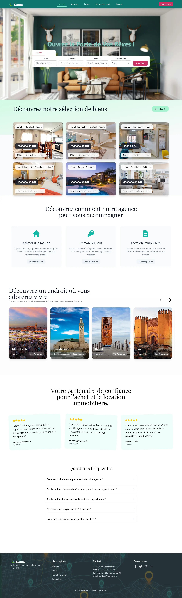
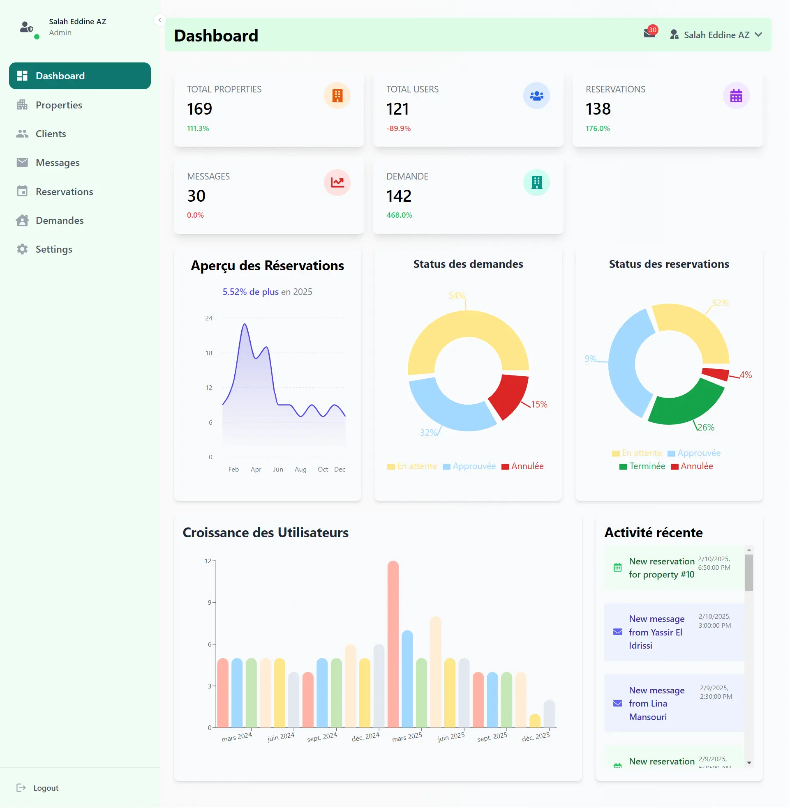
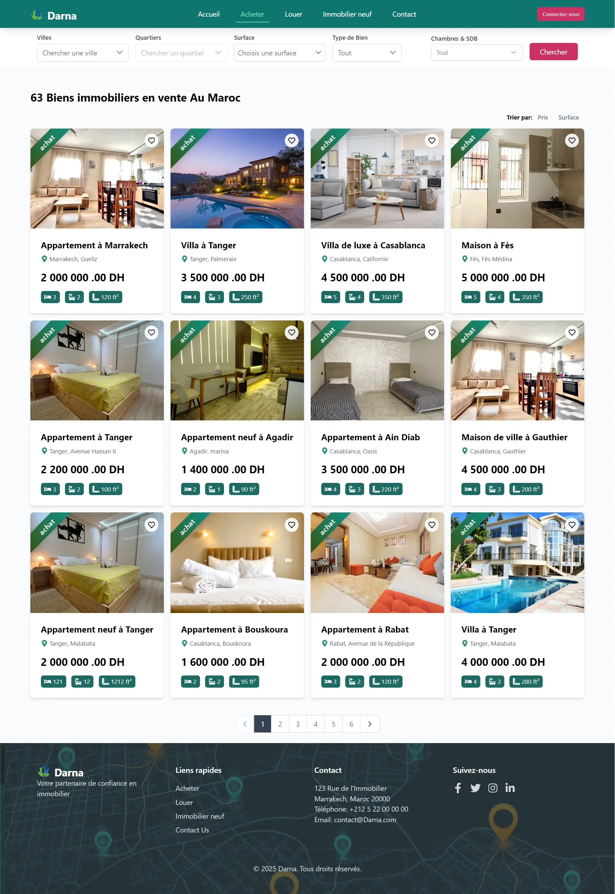
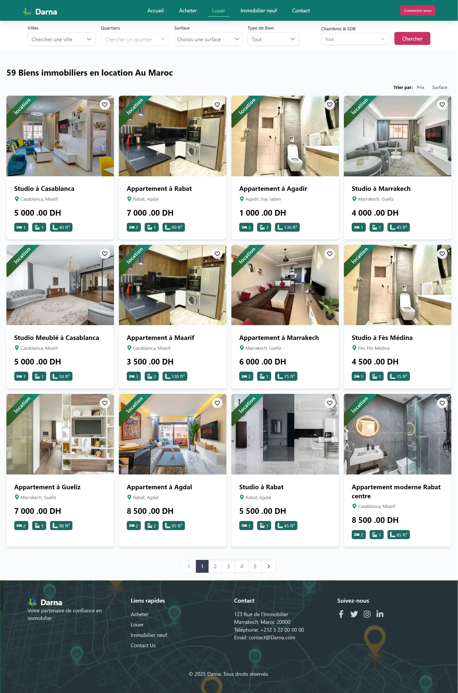
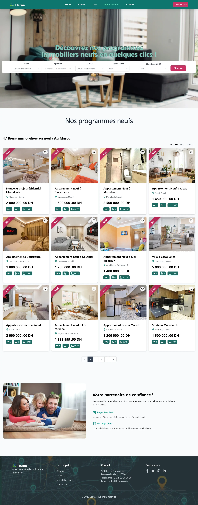
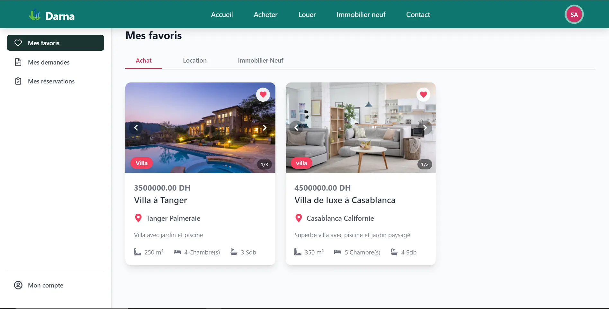
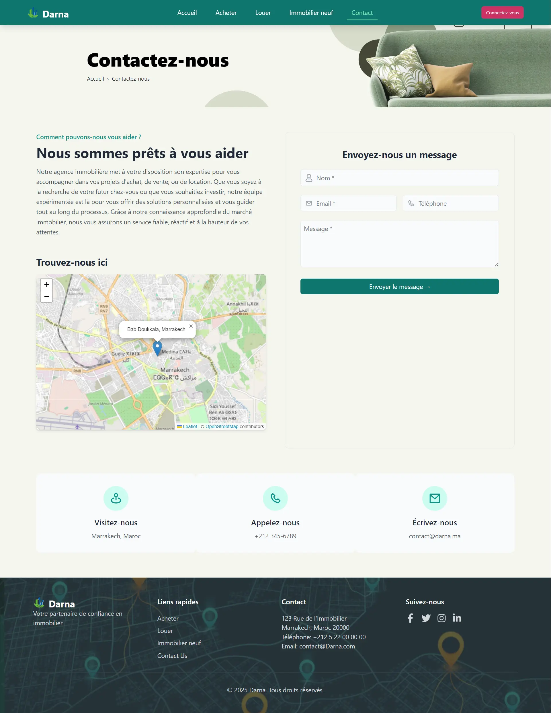

# Darna Real Estate Web App

> **Watch the Darna Demo:** [YouTube Video](https://www.youtube.com/watch?v=ZEBejeKaezA)  
> Click the image above or the link to watch a full walkthrough and demonstration of the Darna Real Estate Platform.

> 🛠 **Collaborative Project**  
> Built by Salah Eddine Ait Zenni and [Mohammed El Gargati](https://github.com/Elgargati) as part of a full-stack development showcase.

> **Showcase Project — Not for Public Use or Contributions**  
> This repository is for portfolio and demonstration purposes only. It is intended to showcase our full-stack development skills using Laravel, React, Inertia.js, and MySQL. It is not intended for production or collaborative development.

---

## 🏗️ Project Overview

**Darna** is a real estate web platform that allows agencies to manage properties and users to browse, filter, favorite, inquire, and request to buy or rent properties. Built with Laravel (backend), React (frontend), Inertia.js, Tailwind CSS, and MySQL, it offers a modern, responsive, and dynamic experience for both clients and administrators.

---

## 🎯 Why Darna? (Skills Demonstrated)

- **Full-Stack Architecture:** Laravel + React + Inertia.js SPA setup  
- **Secure Authentication:** Admin and user login with password reset via email  
- **Role-Based Access:** Feature segmentation based on user roles  
- **Interactive UI:** Built with React + TailwindCSS and powered by Inertia.js  
- **Dynamic Features:** Inquiry/reservation handling, live filters, and feedback via React  
- **Clean Codebase:** Structured with MVC, reusable components, and separation of concerns

---

## ✨ Key Features

- Property management (add/edit/delete) with images and key details
- User registration, login, and profile management
- Secure admin dashboard with statistics and management tools
- Search and filtering for properties by type, location, surface, and price
- Reservation and inquiry system with approval workflow
- Role-specific routing and permissions
- Password reset via secure token and email
- Users can favorite properties for later viewing
- Map integration for property locations
- Messaging interface with real estate agents

---

## 🔧 Technical Highlights

- **Backend:** Laravel (PHP), MySQL, Eloquent ORM  
- **Frontend:** React, Tailwind CSS  
- **SPA Bridge:** Inertia.js  
- **Authentication:** Laravel Breeze  
- **Date Selection:** [`react-datepicker`](https://www.npmjs.com/package/react-datepicker)  
- **Notifications:** [`react-toastify`](https://www.npmjs.com/package/react-toastify)  
- **Mapping:** [`leaflet`](https://leafletjs.com/)  
- **Charts & Analytics:** [`recharts`](https://recharts.org/)  
- **Icons:** [`react-icons`](https://react-icons.github.io/react-icons/)  
- **Form Handling:** Reactive forms and dynamic updates via Inertia.js  

---

## ⚙️ How the Project Works

- Admins manage listings, view reservations and inquiries, and track user activity
- Users can browse properties, filter by custom criteria, add to favorites, send inquiries, and request to rent or buy
- Admin can approve or reject reservation/inquiry requests
- Properties are categorized into Rent, Buy, and New Constructions
- Password reset uses secure token-based system
- All pages are rendered as SPA-like views using Inertia and React

---

## 📸 Screenshots & Demo

### 🏠 Home Page

### 📊 Admin Dashboard

### 🛒 Buy Page (Achat)

### 📍 Location Page

### 🏗️ New Properties (Immobilier Neuf)

### 👤 Profile Page

### ✉️ Contact Page

---

## 👥 Collaboration

This project was developed collaboratively by:

- **Salah Eddine Ait Zenni** – Frontend development, UI/UX design, Inertia.js integration, and overall architecture  
- **[Mohammed El Gargati](https://github.com/Elgargati)** – Backend development, admin functionality, database modeling, and logic for bookings and requests  

We worked together to build a complete full-stack real estate platform from scratch using Laravel, React, and MySQL.

---

## 📬 Contact

For questions or to discuss the project, reach out via:

- GitHub: [salaheddineaz47](https://github.com/salaheddineaz47)  
- Email: salaheddine.aitzenni@gmail.com  
- Portfolio: [https://salahaz.netlify.app/](https://salahaz.netlify.app/)

---

© 2025 Darna. All rights reserved.
